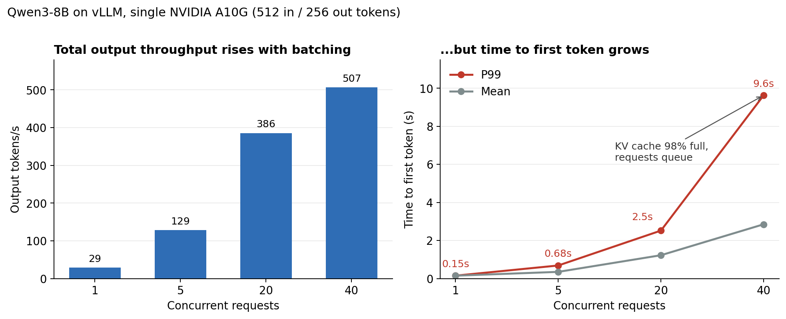

# Serving Qwen3-8B with vLLM on a single A10G: latency vs. throughput

A hands-on benchmark of LLM inference on one GPU, to see the core serving tradeoffs in real numbers: memory-bound decode, prefill vs. decode, continuous batching, the KV cache limit, tail latency, and cost per token.

**Headline:** going from 1 to 20 concurrent requests raised output throughput **13x** (29 → 386 tokens/s) while each user slowed from 29 to 21 tokens/s. At 40 concurrent requests, throughput rose only another 31%, and P99 time to first token reached **9.6 s**, because the KV cache was full and requests had to wait.



## Setup

| | |
|---|---|
| Instance | AWS EC2 `g5.xlarge` (1x NVIDIA A10G, 24 GB) |
| AMI | Deep Learning Base AMI with Single CUDA (Ubuntu 24.04), x86_64 |
| Engine | vLLM 0.30.0, default settings except `--max-model-len 8192` |
| Model | [`Qwen/Qwen3-8B`](https://huggingface.co/Qwen/Qwen3-8B), BF16, no quantization |
| Defaults observed in logs | FlashAttention 2, continuous batching, chunked prefill, prefix caching on, 92% GPU memory reserved |
| Date | October 2026 |

```bash
vllm serve Qwen/Qwen3-8B --max-model-len 8192
```

## Where the GPU memory goes

From the vLLM startup log:

| | GiB |
|---|---|
| Total visible on the GPU | 22.06 |
| vLLM's budget (92%) | 20.3 |
| Weights + non-torch overhead | −15.52 |
| Peak activations | −1.62 |
| **KV cache** | **3.16** |

```
GPU KV cache size: 23,040 tokens, Maximum concurrency for 8,192 tokens per request: 2.81x
```

Qwen3-8B stores about 144 KB of KV cache per token (36 layers × 8 KV heads × 128 dims × keys and values × 2 bytes). 3.16 GiB ÷ 144 KB ≈ 23,000 tokens, which matches the log. That pool is shared by every request in flight, so it caps concurrency: only about 2.8 full-length 8K requests fit at once. A higher `--max-model-len` would shrink that number further.

Startup took about 189 s, including about 44 s of compilation.

## Single-user latency

[`ttft.py`](ttft.py) streams one request at a time, five times, and times the first token and the decode rate.

```
run 1: TTFT 264 ms, ~29.2 tokens/s, total 8.96 s
run 2: TTFT 74 ms, ~29.2 tokens/s, total 9.19 s
run 3: TTFT 75 ms, ~29.2 tokens/s, total 8.85 s
run 4: TTFT 75 ms, ~29.2 tokens/s, total 9.43 s
run 5: TTFT 75 ms, ~29.2 tokens/s, total 8.40 s
```

**Why ~29 tokens/s:** every decode step reads all ~16 GB of weights from GPU memory. The A10G's memory bandwidth is about 600 GB/s, which caps a single request at roughly 37 steps per second in theory. 29 tokens/s is about 80% of that ceiling. Decode for one user is memory-bound; the compute cores sit mostly idle. Run 1 was slower, likely from warm-up and possibly prefix caching on the repeated prompt; these results can't separate the two.

## Under load

`vllm bench serve` with random prompts of 512 input tokens and 256 output tokens, at four concurrency levels. Full output in [`results/bench_summary.txt`](results/bench_summary.txt).

| Concurrency | Output throughput (tok/s) | Per-user speed (tok/s) | Mean TTFT | P99 TTFT | P99 ITL |
|---|---|---|---|---|---|
| 1 | 28.7 | 29.1 | 150 ms | 151 ms | 35 ms |
| 5 | 128.6 | 26.6 | 350 ms | 685 ms | 38 ms |
| 20 | 385.6 | 21.2 | 1.2 s | 2.5 s | 394 ms |
| 40 | 506.6 | 15.5 | 2.8 s | 9.6 s | 494 ms |

Per-user speed = 1,000 ÷ mean time per output token (TPOT). ITL = inter-token latency, measured per individual token gap.

During the 40-concurrency run, the server log showed the cache full and requests queuing:

```
Running: 37 reqs, Waiting: 3 reqs, GPU KV cache usage: 98.0%
```

## What the numbers show

**Batching is nearly free throughput.** One read of the weights produces a token for every request in the batch. vLLM's continuous batching adds and removes requests at every step, so from 1 to 20 users throughput rose 13x while per-user speed dropped only from 29 to 21 tokens/s.

**The KV cache sets the ceiling.** 40 requests × 768 tokens needs about 30,700 tokens of cache; this GPU has 23,040. Past that point, extra requests wait in line instead of running. Throughput gained only 31% from 20 to 40 users, while P99 time to first token nearly quadrupled.

**Prefill and decode are different kinds of work.** At one user, a 512-token prompt was processed in about 150 ms (~3,400 tokens/s, parallel and compute-bound), while each output token took about 34 ms (memory-bound, one at a time).

**Averages hide the stutters.** At 20 users, P99 TPOT was 51 ms, but P99 inter-token latency was 394 ms. Individual gaps spike when a new request's prefill joins the batch and briefly holds up everyone else's next token.

**Utilization drives cost per token.** Assuming $1.00/hr for the instance (check current pricing for your region), output tokens cost:

| Concurrency | Output tokens/hr | Cost per 1M output tokens |
|---|---|---|
| 1 | ~103K | ~$9.67 |
| 5 | ~463K | ~$2.16 |
| 20 | ~1.39M | ~$0.72 |
| 40 | ~1.82M | ~$0.55 |

Same GPU, same model, about 13x cheaper per token at 20 users than at 1. These figures count output tokens only and assume the GPU stays busy.

**The tradeoff:** a latency-sensitive workload should run fewer requests per GPU; a throughput- or cost-sensitive one can pack more. The right setting depends on the latency target, not on a single best number.

## Limitations

- One run per configuration, on one GPU, with default vLLM settings.
- Synthetic random prompts with fixed lengths. Real traffic varies in length and often shares prefixes, which would raise the prefix cache hit rate (about 5% here).
- No quantization, speculative decoding, or tuning of memory settings.

## Reproduce

```bash
# On the instance
sudo apt install -y python3.12-venv
python3 -m venv ~/vllm-env
source ~/vllm-env/bin/activate
pip install vllm openai

# Window 1: start the server
vllm serve Qwen/Qwen3-8B --max-model-len 8192

# Window 2: run the tests
python ttft.py
bash run_benchmarks.sh
python3 summarize.py | tee results/bench_summary.txt
```

Terminate the instance when finished; a stopped instance still bills for storage.

## Next experiments

- FP8 quantization, to see how much freed memory raises the concurrency limit
- Longer prompts, to see prefill-heavy behavior
- Raising the KV cache budget (the log suggests up to ~4.3 GiB is possible)
- The same model on a managed inference platform, compared with this self-managed setup
